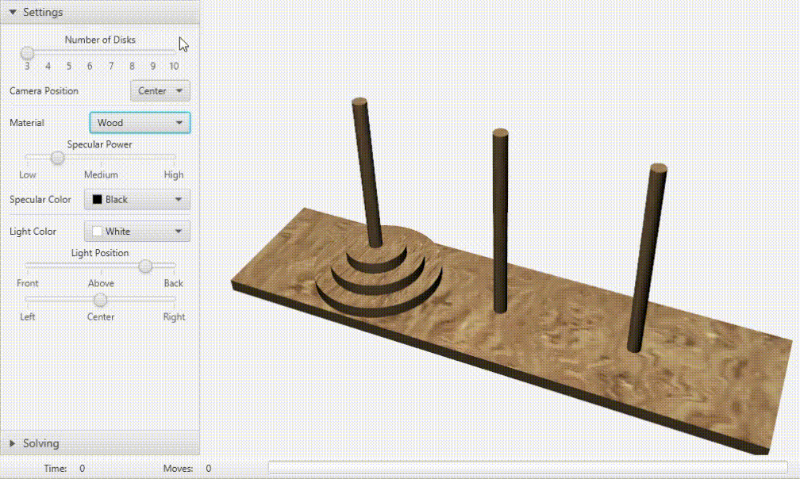

# TowersOfHanoi

## Short application description

An interactive 3D JavaFX application which visualizes the process of solving the *Towers of Hanoi* puzzle.

## Setup

This project uses [Gradle](https://docs.gradle.org/current/userguide/userguide.html).
Open command-line interpreter and simply run `gradlew run` (Windows) or `./gradlew run` (macOS and Linux) to download the Gradle wrapper and dependencies, compile the code, and launch the application.

## Features

*Settings* tab provides the user with different ways of customizing the appearance of the puzzle.
One can define:

- **Number of disks** (3-10), i. e. puzzle difficulty
- **Material**
- **Light color** etc.

Two solving modes are available:

- **Interactive solving** by the user.
  Disks and rods are selected using the primary mouse button.
- Animated step-by-step solving by the computer (**demonstration mode**).
  Animation speed can be fine-tuned.
  Animation can be paused and stopped.

No matter what mode of interaction is chosen, it is always possible to position the camera around the puzzle board by mouse dragging, and to control the distance between camera and the puzzle (i. e. zoom in/zoom out) by mouse scrolling.

## Maps

Diffuse, normal (bump) and specularity maps which were used in this project can be found [here](https://3dtextures.me/).

## Note to the reader of this README

If you have any question, suggestion or collaboration offer, please feel free to [contact me](mailto:danijel.askov@gmail.com).

